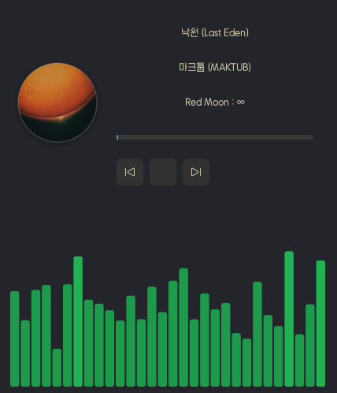

# Music Widget Cpp

## 개요
이 프로젝트는 GTK3 기반의 음악 플레이어 위젯입니다. 데스크탑 화면에 현재 재생 중인 음악 정보를 표시하고 제어하는 기능을 제공합니다.

## 주요 기능
1.  **프리미엄 UI:** 현대적인 유리 질감(Glassmorphism)과 반투명 배경을 적용한 세련된 레이아웃.
2.  **앨범 아트워크 표시:** 재생 중인 음악의 아트워크를 Cairo를 통해 **원형(Circular)**으로 절단하고 부드러운 **그림자** 효과 적용.
3.  **음악 플레이어 제어:** 재생, 일시정지, 다음 곡, 이전 곡 제어 및 진행 상태 바(Progress Bar) 표시.
4.  **지능형 플레이어 감지:** `musikcube`, `spotify` 등 음악 플레이어를 우선 감지하며 브라우저(크롬 등)의 간섭을 차단하는 Sticky 연결 로직 적용.
5.  **위젯 위치 및 크기 자유 조절:** CTRL 키 없이 드래그로 이동 가능하며, 테두리를 잡아 자유롭게 리사이즈 가능 (Wayland 네이티브 드래그 지원).
6.  **안정적인 스펙트럼 시각화:** CAVA 외부 의존성 없이 위젯 자체에서 부드럽게 작동하는 통합 스펙트럼 시큘레이션.
7.  **강력한 안정성:** D-Bus 통신 예외 처리 및 타임아웃 설정을 통해 강제 종료 및 프리징 현상 해결.
8.  **Wayland 호환성:** Wayland 환경에서도 가상 화면을 따라다니고 정상적으로 동작하도록 최적화.

## 기술 스택
*   **언어:** C++11 이상
*   **GUI 라이브러리:** GTKmm (GTK 3의 C++ 래퍼)
*   **컴파일러:** g++ (GCC) 또는 clang (Clang)
*   **빌드 시스템:** CMake

## 빌드 및 실행 방법

### 1. 필수 라이브러리 설치
```bash
sudo apt update
sudo apt install build-essential pkg-config \
                 libgtkmm-3.0-dev libglibmm-2.4-dev \
                 libgirepository1.0-dev libcairo2-dev \
                 libdbus-1-dev cmake
```

### 2. 프로젝트 빌드
프로젝트 루트 디렉토리에서 다음 명령어를 실행합니다.
```bash
mkdir build
cd build
cmake ..
make
```

### 3. 애플리케이션 실행
빌드 디렉토리에서 다음 명령어를 실행합니다.
```bash
./MusicWidgetCpp
```

## 스크린샷
